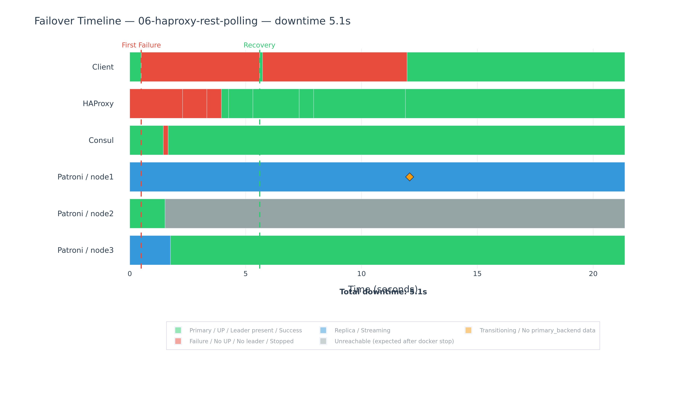
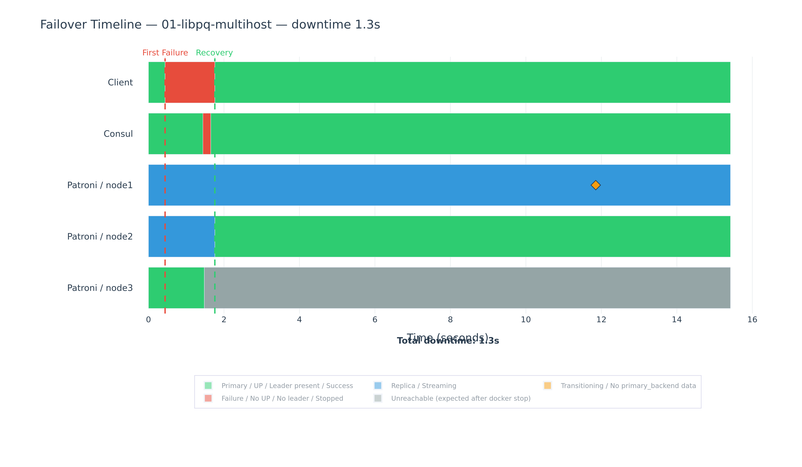
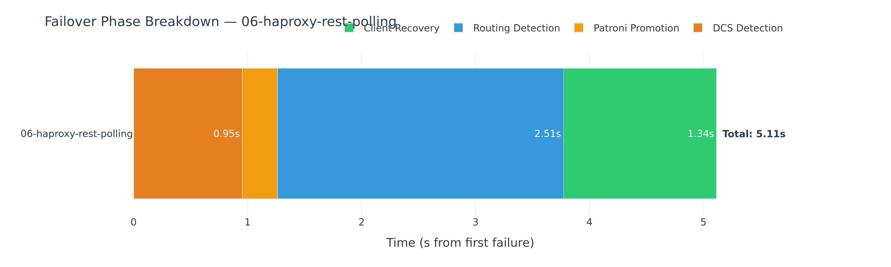

# patroni-routing-bench

**Measure PostgreSQL failover timing at every layer of the routing stack — on your own Patroni cluster.**

When a Patroni-managed PostgreSQL primary fails, multiple components react in a cascade: the DCS detects the leader is gone, Patroni promotes a replica, the routing layer discovers the new topology, and the client reconnects. This tool captures timestamped events at every layer and shows you exactly where time is spent.

> **Scope:** This tool measures *infrastructure failover visibility* — how long each layer takes to detect and propagate a topology change. It does not measure application-level recovery (connection pool rebuild, transaction retry, cache invalidation) or RPO/data loss. These are illustrative scenarios on a controlled environment; your production timing will differ based on hardware, network, and configuration.

## What It Measures

The routing layer between your application and PostgreSQL affects failover behavior in four ways. This tool measures each one independently:

| Dimension | What it answers | Status |
|---|---|---|
| **Failover timing** | When the primary dies, how long until my queries work again? Where is that time spent? | ✅ Implemented |
| **Connection establishment** | How long does each routing layer take to establish a new connection? | 🔜 Planned |
| **Steady-state latency** | How much per-query overhead does each routing layer add during normal operation? | 🔜 Planned |
| **Connection storm** | When 500 clients reconnect simultaneously after failover, how does each layer handle it? | 🔜 Planned |

Dimensions 2–4 become especially interesting when **PgBouncer** is added to the stack — the connection pooler changes how each routing layer behaves during failover and under load. See [Future Work](#the-pgbouncer-factor) for details.

---

## Use It on Your Cluster

You don't need to run our benchmark to use this tool. If you already have a Patroni cluster, measure its failover timing directly.

**Requirements:** Docker on one machine + network access to your cluster. No changes to your infrastructure.

```
Your machine (Docker)                Your cluster (untouched)
┌──────────────────────────┐         ┌──────────────────────────┐
│ TimescaleDB              │         │ Patroni node1 (:8008)    │
│ observer-patroni ────────┼── HTTP ─┤ Patroni node2 (:8008)    │
│ observer-consul  ────────┼── HTTP ─┤ Patroni node3 (:8008)    │
│ observer-haproxy ────────┼── HTTP ─┤ Consul server (:8500)    │
│ client-failover  ────────┼── TCP ──┤ HAProxy / VIP / DNS      │
│ chart-generator          │         │ PostgreSQL (:5432)        │
└──────────────────────────┘         └──────────────────────────┘
```

### Quick Start

```bash
cd tool/

# 1. Configure — fill in your Patroni IPs, Consul URL, PG connection
cp .env.example .env
vim .env

# 2. Start observers + heartbeat client
docker compose up -d
docker compose --profile failover up -d

# 3. Inject failure (you control this)
ssh admin@leader "sudo systemctl stop patroni"

# 4. Watch recovery — failover is auto-detected and measured
docker compose logs -f client-failover
#   [auto-test-run] Downtime: 6322ms, Failed queries: 3

# 5. Generate report
docker compose --profile charts run --rm charts db-report --output /results/report.html
open results/report.html
```

See [tool/README.md](tool/README.md) for full instructions, troubleshooting, and multi-test comparisons.

The observers run on YOUR machine as Docker containers, connecting remotely to your Patroni REST API, Consul, and PostgreSQL. They capture timestamped events at every layer — DCS detection, PostgreSQL promotion, routing update, client recovery — and store them in a local TimescaleDB.

Works with any routing layer: HAProxy, VIP (vip-manager, keepalived), Consul DNS, libpq multi-host, or any custom setup. If your routing layer is HAProxy, add the HAProxy observer: `docker compose --profile haproxy up -d`.

---

## Benchmark Results

We used this tool to benchmark 9 routing strategies in a controlled Docker environment. 135 test runs (9 combinations × 3 scenarios × 5 iterations), all successful.

Median client-perceived downtime (seconds):

| Combination | Category | hard_stop | hard_kill | switchover |
|---|---|---|---|---|
| 03 — vip-manager (poll) | VIP | 1.2s | 23.0s | 1.0s |
| 01 — libpq multi-host | Client | 1.3s | 21.2s | 1.2s |
| 02 — Consul DNS | DNS | 2.1s | 28.4s | 2.1s |
| 07 — consul-template reload | HAProxy | 5.2s | 23.8s | 4.6s |
| 04 — VIP Patroni callback | VIP | 6.6s | 26.1s | 4.1s |
| 06 — HAProxy REST poll | HAProxy | 9.1s | 29.1s | 6.2s |
| 06t — HAProxy REST poll (tuned) | HAProxy | 9.2s | 20.0s | 5.6s |
| 09 — Patroni callback → HAProxy | HAProxy | 9.2s | 30.8s | 6.6s |
| 08 — consul-template runtime API | HAProxy | 10.1s | 29.4s | 4.0s |

> **Note:** Results are from a Docker Desktop / WSL2 environment with the full observer stack. Absolute numbers will differ on production hardware. Use the tool on your own infrastructure for production-representative numbers.

### Key Findings

- **Graceful failovers (hard_stop, switchover) vary across routing layers** — from 1.2s (VIP poll) to 10.1s (consul-template Runtime API).
- **Ungraceful failovers (hard_kill) are dominated by the Consul session TTL** (30s default). All combinations converge to 20–31s regardless of routing layer. Reducing TTL from 30 to 20 improved hard_kill by 31%.
- **The simplest approaches are the fastest.** VIP poll (1.2s) and libpq multi-host (1.3s) match or beat every infrastructure-based routing layer. The value of a proxy is operational (connection pooling, read/write split, observability), not failover speed.
- **Server-side failover is fast and consistent.** DCS detection + PostgreSQL promotion takes ~3.8 seconds across all 9 combinations. The routing layer is where time is lost.
- **consul-template + reload (combo 07) is the fastest HAProxy variant** at 5.2s — event-driven detection plus a full reload that bypasses rise threshold delays.
- **Consul DNS speed depends on health check timing, not DNS TTL.** With TTL=0s, failover ranges from 2.1s to 6.9s depending on where in the 5s health check cycle the promotion lands.
- **HAProxy accepts TCP connections with no healthy backend**, causing 5-second connect_timeout hangs. Reducing connect_timeout is a client-side tuning that directly reduces measured failover time.
- **Failure mode matters more than routing layer.** The difference between graceful (1–10s) and ungraceful (20–31s) failure dwarfs routing layer differences. Ensure clean shutdowns.

### Per-Component Timing Breakdown

The tool doesn't just measure total downtime — it captures timestamped events at every layer, showing exactly where time is spent during a failover.

**HAProxy REST polling (combo 06) — hard_stop, 9.1s total:**



The routing layer (HAProxy health checks at `inter 2s × fall 3`) accounts for most of the downtime. Patroni promotion and DCS detection happen within the first 1-2 seconds — the remaining 7+ seconds is HAProxy discovering the new primary.

**libpq multi-host (combo 01) — hard_stop, 1.3s total:**



With libpq multi-host, the client detects the new primary directly — no routing layer delay. The entire failover is bounded by DCS detection + PostgreSQL promotion.

**Phase breakdown — where bottlenecks shift:**



Each routing layer shifts the bottleneck to a different component. HAProxy combinations are dominated by health check polling intervals and client connect_timeout hangs. VIP poll (combo 03) is fast because clients get instant "Connection refused" during transition. VIP callback (combo 04) is slower because client connections can reach the new node before PostgreSQL promotion completes, causing connect_timeout hangs. Consul DNS combinations depend on the Consul service health check interval (5s), not DNS TTL. The tool makes these bottleneck shifts visible.

> **Key insight:** Tuning Patroni (`loop_wait`, `ttl`) only helps when Patroni is the bottleneck. If the routing layer dominates (as in HAProxy combinations), reducing `loop_wait` from 10s to 5s has zero impact on total downtime. The per-component breakdown tells you where to focus optimization effort.

### Where Time Is Spent (Combo 06 Baseline)

During a `hard_stop` failover with HAProxy REST polling:

| Phase | Typical Duration | What Happens |
|---|---|---|
| DCS detection | ~1s | Consul blocking query detects leader key change |
| PostgreSQL promotion | ~2.7s | New primary accepts connections (PG ready: 3.8s after failure) |
| Routing detection | ~5.4s | HAProxy health checks detect the new primary (`inter 2s × fall 3`) |
| Client recovery | ~0s | Client reconnects immediately once HAProxy switches |
| **Total downtime** | **~9.1s** | End-to-end client-perceived outage |

```
Critical path: DCS detection (1.0s) → PG promotion (2.7s) → Routing detection (5.4s) → Client recovery (~0s) = 9.1s total
Dominant factor: Routing layer (HAProxy health check polling)
Optimization target: Reduce inter/fall values, or switch to event-driven routing (combos 07-09)
```

---

## 9 Routing Combinations

Each combination deploys the same Patroni + PostgreSQL + Consul infrastructure with a different routing layer:

| # | Name | Routing Mechanism | Category |
|---|---|---|---|
| 01 | libpq-multihost | `target_session_attrs=primary` in connection string | Client-side |
| 02 | consul-dns | Consul DNS with health checks on `/primary` endpoint | DNS |
| 03 | vip-manager-poll | vip-manager polls Consul KV, binds floating VIP | VIP |
| 04 | vip-patroni-callback | Patroni `on_role_change` callback runs `ip addr add` | VIP |
| 06 | haproxy-rest-polling | HAProxy polls Patroni REST API (`/primary`) | HAProxy |
| 06t | haproxy-rest-polling-tuned | Same as 06 with `ttl: 20` | HAProxy |
| 07 | consul-template-reload | consul-template watches Consul catalog, reloads HAProxy | HAProxy |
| 08 | consul-template-runtime-api | consul-template uses HAProxy Runtime API (no reload) | HAProxy |
| 09 | patroni-callback-haproxy | Patroni callback flips HAProxy backends via Runtime API | HAProxy |

Each combination has its own README with architecture details and usage instructions.

---

## Failure Scenarios

| Scenario | Mechanism | What It Tests |
|---|---|---|
| `hard_stop` | `docker stop` (SIGTERM) | Graceful shutdown — Patroni releases Consul session, routing layer detects quickly |
| `hard_kill` | `docker kill` (SIGKILL) | Abrupt crash — no cleanup, routing must wait for Consul session TTL expiry |
| `switchover` | `patronictl switchover --force` | Planned operation — orchestrated transition, best-case timing |

---

## Running the Benchmark Lab

To reproduce our results or add new routing combinations:

### 1. Start the dashboard

```bash
git clone https://github.com/jlluesma/patroni-routing-bench.git
cd patroni-routing-bench

# Start dashboard (core: TimescaleDB + Grafana)
cd dashboard && docker compose up -d

# Optional: start Prometheus for infrastructure metrics
# cd dashboard && docker compose --profile metrics up -d
```

### 2. Run a single combination

```bash
cd ../dcs/consul/06-haproxy-rest-polling
docker compose up -d --build
sleep 60
docker exec prb-06-node1 patronictl -c /etc/patroni/patroni.yml list
```

### 3. Run a failover test

```bash
cd ~/patroni-routing-bench
./runner/run_failover_test.sh \
    --combo-dir 06-haproxy-rest-polling \
    --combo-id 06-haproxy-rest-polling \
    --prefix prb-06 \
    --scenario all --iterations 3
```

### 4. Run the full batch (all 9 combinations)

```bash
./runner/run_batch.sh --generate-report --batch-report --skip "05,10" --iterations 3
```

Results saved to `runner/results/batch_<timestamp>/`: `results.csv` and interactive `batch_report.html`.

### 5. Tear down

```bash
cd dcs/consul/06-haproxy-rest-polling && docker compose down -v
cd ~/patroni-routing-bench/dashboard && docker compose down -v
```

---

## Running on GCP

The Docker benchmark runs in containers on a single machine — fast to set up, but Docker networking adds overhead (no real ARP, overlay bridging, WSL2 variance). To validate results on production-representative infrastructure, deploy to real GCP Compute Engine VMs using the Terraform + Ansible setup in `deploy/gcp/`.

**6 VMs, ~$0.17/hr, ~$0.35 per test session.**

```
patroni-1/2/3 (e2-medium)  — PostgreSQL 18 + Patroni + Consul agent
consul-srv    (e2-small)   — Consul server (DCS)
haproxy       (e2-small)   — HAProxy REST polling (combo 06 equivalent)
observer      (e2-medium)  — Docker + tool/ stack, generates reports
```

```bash
# 1. Deploy infrastructure
cd deploy/gcp/terraform
cp terraform.tfvars.example terraform.tfvars   # set project_id
terraform init && terraform apply              # writes ansible/inventory/gcp.ini

# 2. Configure the cluster
cd ../ansible
ansible-playbook -i inventory/gcp.ini site.yml

# 3. Run the tool from the observer VM
ssh deploy@$(cd ../terraform && terraform output -raw observer_external_ip)
cd /opt/patroni-routing-bench/tool && cp .env.gcp .env
docker compose up -d && docker compose --profile failover up -d

# 4. Inject a failover
cd deploy/gcp
./scripts/failover-test.sh --scenario hard_stop --target patroni-1

# 5. Tear down
./scripts/teardown.sh
```

Failure injection uses Ansible (`deploy/gcp/ansible/inject.yml` with the `failure_injection` role) rather than raw SSH — supports `hard_stop`, `hard_kill`, `switchover`, `postgres_crash`, and `network_partition` (real `iptables DROP`, not Docker disconnect).

See [`deploy/gcp/README.md`](deploy/gcp/README.md) for full documentation, cost breakdown, and expected impact on results vs the Docker benchmark.

---

## Observer Agents

Lightweight Python daemons that watch each infrastructure component and emit timestamped state-change events to TimescaleDB.

| Component | Watches | Key Events |
|---|---|---|
| `patroni` | REST API `/patroni` on all 3 nodes | `role_change`, `node_state_change` |
| `consul` | KV leader key (blocking queries) | `leader_key_deleted`, `leader_key_created` |
| `haproxy` | Stats CSV endpoint | `backend_state_change` (UP/DOWN) |
| `postgres` | Direct SQL on each node (`pg_is_in_recovery()`) | `pg_promote_detected`, `pg_connection_lost`, `pg_ready_accept_connections` |
| `vip` | Network interface (`ip addr show`) | `vip_state_change` (bound/unbound) |

Observers use **multi-target mode**: one container watches all nodes of a component type simultaneously via the `WATCHER_TARGETS` environment variable.

---

## Project Structure

```
patroni-routing-bench/
├── tool/                             # MEASUREMENT TOOL — use on your cluster
│   ├── docker-compose.yml            # One compose file, profiles per feature
│   ├── .env.example                  # User fills in their endpoints
│   ├── observers/                    # Observer agent Docker image
│   ├── clients/failover/             # Heartbeat client for failover timing
│   ├── timescaledb/schema/           # Auto-applied on first start
│   ├── charts/                       # Report generation (Plotly)
│   └── results/                      # Generated reports
│
├── dcs/consul/                       # BENCHMARK LAB — 9 routing combinations
│   ├── 01-libpq-multihost/
│   ├── 02-consul-dns/
│   ├── ...
│   └── 09-patroni-callback-haproxy/
│
├── dashboard/                        # Observability stack (for benchmark lab)
│   ├── docker-compose.yml            # TimescaleDB + Prometheus + Grafana
│   └── charts/                       # Chart generation
│
├── runner/                           # Benchmark automation
│   ├── run_failover_test.sh          # Single-combo test driver
│   └── run_batch.sh                  # Multi-combo batch orchestrator
│
├── shared/docker/                    # Shared Docker images
│   ├── postgres-patroni/             # PostgreSQL 18 + Patroni base image
│   ├── client/                       # Heartbeat client
│   └── observer/                     # Observer agent
│
├── deploy/gcp/                       # GCP DEPLOYMENT — real VMs, Terraform + Ansible
│   ├── terraform/                    # VPC, 6 VMs, generates Ansible inventory
│   ├── ansible/                      # site.yml + roles (common, consul, postgresql, patroni, haproxy, observer)
│   └── scripts/                      # failover-test.sh, teardown.sh
│
└── observer/schema/                  # TimescaleDB schema (canonical)
```

---

## Configuration Reference

### Patroni DCS Timing

```yaml
bootstrap:
  dcs:
    ttl: 30         # Leader lock TTL — time before dead leader's lock expires
    loop_wait: 10   # HA loop interval — how often replicas check DCS state
    retry_timeout: 10
```

These settings directly affect ungraceful failover timing. `ttl: 30` means a hard_kill waits up to 30s before replicas can acquire the leader lock.

### Runtime Configuration Visibility

Every test run captures the active Patroni configuration at the start,
so results are always reproducible:

```
[CONFIG] Patroni DCS settings:
  loop_wait: 10
  ttl: 30
  retry_timeout: 10
  synchronous_mode: false
  maximum_lag_on_failover: 1048576
```

These parameters define the lower bound of failover detection. Aggressive
tuning (e.g., `ttl: 10`, `loop_wait: 3`) reduces detection time but
increases the risk of false failovers during transient network issues.
The benchmark uses standard Patroni defaults across all combinations to
ensure fair comparison.

### HAProxy Health Check (Combos 06–09)

```
default-server inter 2s fall 3 rise 2
```

- `inter 2s` — check every 2 seconds
- `fall 3` — 3 consecutive failures to mark DOWN (worst-case detection: 6s)
- `rise 2` — 2 consecutive passes to mark UP

### Tuning Trade-offs

Reducing timing parameters improves failover speed but introduces risks:

| Parameter | Aggressive Value | Risk |
|---|---|---|
| `ttl` < 15s | Leader lock expires too fast | False failovers during GC pauses or network blips |
| `loop_wait` < 5s | Patroni polls DCS too frequently | Increased DCS load, potential instability |
| HAProxy `inter` < 1s | Health checks too frequent | Increased load on Patroni REST API |
| HAProxy `fall` < 2 | Too few failures before marking DOWN | Flapping backends on transient errors |

The benchmark uses standard defaults (`ttl: 30`, `loop_wait: 10`, `inter: 2s`, `fall: 3`) across all combinations. The "tuned" variant (combo 06t) demonstrates the effect of reducing `ttl` from 30 to 20, showing that tuning the DCS primarily affects `hard_kill` scenarios where session TTL dominates.

---

## Grafana Dashboards

| Dashboard | Purpose |
|---|---|
| Failover Timeline | Swimlane view of all components during a failover — the main analysis tool |
| Combination Comparison | Side-by-side downtime across routing strategies |

Access at http://localhost:3000 (admin/admin) when running the benchmark lab.

---

## Known Limitations

- **Docker benchmark environment** — results reflect Docker networking behavior, not bare-metal or cloud. Use the [measurement tool](#use-it-on-your-cluster) on your own infrastructure for production-representative numbers.
- **Single-node Consul** — production deployments use 3+ Consul servers. Single-node Consul has no Raft consensus overhead.
- **No concurrent load** — the heartbeat client sends sequential queries. Production failovers under heavy load may behave differently.
- **Clock synchronization** — The per-component timing breakdown (Gantt charts, phase waterfall) depends on synchronized clocks across all observed nodes. In the Docker benchmark lab, all containers share the host kernel clock — no drift. When using the [measurement tool](#use-it-on-your-cluster) against real VMs across multiple hosts, ensure NTP is configured. Run `timedatectl status` on each node and verify "synchronized: yes". Check offset with `chronyc tracking` — aim for less than 10ms for accurate Gantt diagrams. If clocks are not synchronized, the Gantt diagram may show false overlaps or incorrect phase ordering. The total downtime measurement (client-perceived) is unaffected because it uses a single clock source (the heartbeat client container).

---

## Future Work

### The PgBouncer Factor

The current benchmark tests routing layers in isolation: one client, direct connections, no connection pooling. In production, **PgBouncer is commonly deployed at different points in the stack** — on the application side (App → PgBouncer → HAProxy → PostgreSQL), colocated with the database (App → HAProxy → PgBouncer → PostgreSQL), or as standalone pooler (App → PgBouncer → PostgreSQL). Each placement changes failover dynamics differently:

- **Connection establishment time** — how fast does PgBouncer re-establish its backend pool after a failover through each routing layer?
- **Steady-state latency overhead** — Client → PgBouncer → HAProxy → PostgreSQL is three hops. Client → PgBouncer → VIP → PostgreSQL is two. What's the per-hop cost?
- **Connection storm behavior** — PgBouncer absorbs the client storm, but must reconnect to PostgreSQL through the routing layer. Pool explosion risk (`num_pools × pool_size`) varies by routing strategy.
- **Pool rebuild timing** — after a VIP migration, all PgBouncer backend connections break simultaneously. With HAProxy, PgBouncer connects to a stable endpoint. Each routing layer creates a different pool rebuild profile.

Adding PgBouncer to each combination would test the routing layer as part of a realistic production stack — the natural next phase of this project.

### Additional Plans
- **etcd DCS support** — parallel routing strategies for DCS comparison
- **Cloud deployment** — Terraform + Ansible for AWS/GCP with real infrastructure
- **Network partition scenario** — reliable implementation using `tc netem`
- **Docker Hub images** — pre-built observer and client images for zero-build setup

---

## Troubleshooting

**Docker won't start (WSL2):**
```bash
sudo update-alternatives --set iptables /usr/sbin/iptables-legacy
sudo service docker start
```

**Cluster not healthy after failover:**
```bash
docker start prb-06-node2
sleep 30
docker exec prb-06-node1 patronictl -c /etc/patroni/patroni.yml list
```

**Observer events missing:** `docker ps | grep obs` — verify observer containers are running.

**Runner reports TIMEOUT:** Verify cluster is fully healthy (1 Leader + 2 streaming Replicas) before starting a test.

---

## Related Articles

1. [Patroni + PostgreSQL Routing Deep Dive: Guide to Client Connections](https://medium.com/@jlluesma85/patroni-postgresql-routing-deep-dive-guide-to-client-connections-73d3b9168173)
2. [Measuring What Nobody Measures: Empirical Failover Timing in Patroni](https://medium.com/@jlluesma85/measuring-what-nobody-measures-empirical-failover-timing-in-patroni-with-a-custom-observability-022e7d9a589d)

---

## Contributing

Contributions welcome:

- **New routing combinations** — add a strategy we haven't covered
- **New measurement dimensions** — implement connection establishment, latency, or storm clients
- **Observer improvements** — new component watchers or better detection precision
- **Cloud providers** — Terraform/Ansible configs for AWS/GCP deployment
- **etcd support** — the DCS layer is designed to be swappable

---

## Prerequisites

- Docker and Docker Compose v2
- For the measurement tool: Docker on one machine + network access to your cluster
- For the benchmark lab: 8GB RAM minimum (14+ containers running simultaneously)

---

## License

MIT

---

*Built with PostgreSQL 18, Patroni, Consul, TimescaleDB, Grafana, and Plotly.*
